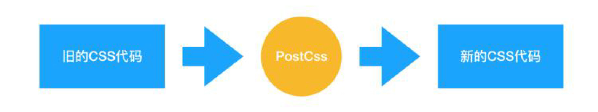

# 大厂前端面试题精选

## CSS 部分

### 1. display 的 block、inline 和 inline-block 的区别
**block**：会独占一行，多个元素会另起一行，可以设置 width、height、margin 和 padding 属性；
**inline**：元素不会独占一行，设置 width、height 属性无效。但可以设置水平方向的 margin 和 padding 属性，不能设置垂直方向的 padding 和 margin；
**inline-block**：将对象设置为 inline 对象，但对象的内容作为 block 对象呈现，之后的内联对象会被排列在同一行内。
对于行内元素和块级元素，其特点如下：
1. 行内元素
设置宽高无效；
可以设置水平方向的 margin 和 padding 属性，不能设置垂直方向的 padding 和 margin；
不会自动换行；
2. 块级元素
可以设置宽高；
设置 margin 和 padding 都有效；
可以自动换行；
多个块状，默认排列从上到下。

### 2. link 和 @import 的区别
两者都是外部引用 CSS 的方式，它们的区别如下：
link 是 XHTML 标签，除了加载 CSS 外，还可以定义 RSS 等其他事务；@import 属于 CSS 范畴，只能加载 CSS。
link 引用 CSS 时，在页面载入时同时加载；@import 需要页面网页完全载入以后加载。
link 是 XHTML 标签，无兼容问题；@import 是在 CSS2.1 提出的，低版本的浏览器不支持。
link 支持使用 Javascript 控制 DOM 去改变样式；而 @import 不支持。

### 3. CSS3 中有哪些新特性
新增各种 CSS 选择器（:not(.input)：所有 class 不是“input”的节点）
圆角 （border-radius:8px)
多列布局 （multi-column layout）
阴影和反射 （Shadoweflect）
文字特效 （text-shadow）
文字渲染 （Text-decoration）
线性渐变 （gradient）
旋转 （transform）
增加了旋转、缩放、定位、倾斜、动画、多背景

### 4. 对 CSSSprites 的理解
CSSSprites（精灵图），将一个页面涉及到的所有图片都包含到一张大图中去，然后利用 CSS 的 background-image，background-repeat，background-position 属性的组合进行背景定位。
- 优点：
利用 CSS Sprites 能很好地减少网页的 http 请求，从而大大提高了页面的性能，这是 CSS Sprites 最大的优点；
CSS Sprites 能减少图片的字节，把 3 张图片合并成 1 张图片的字节总是小于这 3 张图片的字节总和。
- 缺点：
在图片合并时，要把多张图片有序的、合理的合并成一张图片，还要留好足够的空间，防止板块内出现不必要的背景。在宽屏及高分辨率下的自适应页面，如果背景不够宽，很容易出现背景断裂；
CSSSprites 在开发的时候相对来说有点麻烦，需要借助 photoshop 或其他工具来对每个背景单元测量其准确的位置。
维护方面：CSS Sprites 在维护的时候比较麻烦，页面背景有少许改动时，就要改这张合并的图片，无需改的地方尽量不要动，这样避免改动更多的 CSS，如果在原来的地方放不下，又只能（最好）往下加图片，这样图片的字节就增加了，还要改动 CSS。

### 5. CSS 优化和提高性能的方法有哪些？
**加载性能**：
1. css 压缩：将写好的 css 进行打包压缩，可以减小文件体积。
2. css 单一样式：当需要下边距和左边距的时候，很多时候会选择使用 margin:top 0 bottom 0; 但 margin-bottom: bottom; margin-left: left;执行效率会更高。
3. 减少使用@import，建议使用 link，因为后者在页面加载时一起加载，前者是等待页面加载完成之后再进行加载。
**选择器性能**：
1. 关键选择器（key selector）。选择器的最后面的部分为关键选择器（即用来匹配目标元素的部分）。CSS 选择符是从右到左进行匹配的。当使用后代选择器的时候，浏览器会遍历所有子元素来确定是否是指定的元素等等；
2. 如果规则拥有 ID 选择器作为其关键选择器，则不要为规则增加标签。过滤掉无关的规则（这样样式系统就不会浪费时间去匹配它们了）。
3. 避免使用通配规则，如*{}计算次数惊人，只对需要用到的元素进行选择。
4. 尽量少的去对标签进行选择，而是用 class。
5. 尽量少的去使用后代选择器，降低选择器的权重值。后代选择器的开销是最高的，尽量将选择器的深度降到最低，最高不要超过三层，更多的使用类来关联每一个标签元素。
6. 了解哪些属性是可以通过继承而来的，然后避免对这些属性重复指定规则。
**渲染性能**：
1. 慎重使用高性能属性：浮动、定位。
2. 尽量减少页面重排、重绘。
3. 去除空规则：｛｝。空规则的产生原因一般来说是为了预留样式。去除这些空规则无疑能减少 css 文档体积。
4. 属性值为 0 时，不加单位。
5. 属性值为浮动小数 0.**，可以省略小数点之前的 0。
6. 标准化各种浏览器前缀：带浏览器前缀的在前。标准属性在后。
7. 不使用 @import 前缀，它会影响 css 的加载速度。
8. 选择器优化嵌套，尽量避免层级过深。
9. css 雪碧图，同一页面相近部分的小图标，方便使用，减少页面的请求次数，但是同时图片本身会变大，使用时，优劣考虑清楚，再使用。
10. 正确使用 display 的属性，由于 display 的作用，某些样式组合会无效，徒增样式体积的同时也影响解析性能。
11. 不滥用 web 字体。对于中文网站来说 WebFonts 可能很陌生，国外却很流行。web fonts 通常体积庞大，而且一些浏览器在下载 webfonts 时会阻塞页面渲染损伤性能。
**可维护性、健壮性**：
1. 将具有相同属性的样式抽离出来，整合并通过 class 在页面中进行使用，提高 css 的可维护性。
2. 样式与内容分离：将 css 代码定义到外部 css 中。

### 6. 对 CSS 工程化的理解
CSS 工程化是为了解决以下问题：
1. 宏观设计：CSS 代码如何组织、如何拆分、模块结构怎样设计？
2. 编码优化：怎样写出更好的 CSS？
3. 构建：如何处理我的 CSS，才能让它的打包结果最优？
4. 可维护性：代码写完了，如何最小化它后续的变更成本？如何确保任何一个同事都能轻松接手？
以下三个方向都是时下比较流行的、普适性非常好的 CSS 工程化实践：
预处理器：Less、 Sass 等；
重要的工程化插件： PostCss；
Webpack loader 等 。

基于这三个方向，可以衍生出一些具有典型意义的子问题，这里我们逐个来看：
1. 预处理器：为什么要用预处理器？它的出现是为了解决什么问题？
预处理器，其实就是 CSS 世界的“轮子”。预处理器支持我们写一种类似 CSS、但实际并不是 CSS 的语言，然后把它编译成 CSS 代码：

那为什么写 CSS 代码写得好好的，偏偏要转去写“类 CSS”呢？这就和本来用 JS 也可以实现所有功能，但最后却写 React 的 jsx 或者 Vue 的模板语法一样——了爽！要想知道有了预处理器有多爽，首先要知道的是传统 CSS 有多不爽。随着前端业务复杂度的提高，前端工程中对 CSS 提出了以下的诉求：
- 宏观设计上：我们希望能优化 CSS 文件的目录结构，对现有的 CSS 文件实现复用；
- 编码优化上：我们希望能写出结构清晰、简明易懂的 CSS，需要它具有一目了然的嵌套层级关系，而不是无差别的一铺到底写法；我们希望它具有变量特征、计算能力、循环能力等等更强的可编程性，这样我们可以少写一些无用的代码；
- 可维护性上：更强的可编程性意味着更优质的代码结构，实现复用意味着更简单的目录结构和更强的拓展能力，这两点如果能做到，自然会带来更强的可维护性。
这三点是传统 CSS 所做不到的，也正是预处理器所解决掉的问题。
预处理器普遍会具备这样的特性：
嵌套代码的能力，通过嵌套来反映不同 css 属性之间的层级关系；
支持定义 css 变量；
提供计算函数；
允许对代码片段进行 extend 和 mixin；
支持循环语句的使用；
支持将 CSS 文件模块化，实现复用。
2. PostCss：PostCss 是如何工作的？我们在什么场景下会使用 PostCss？
PostCss 仍然是一个对 CSS 进行解析和处理的工具，它会对 CSS 做这样的事情：

它和预处理器的不同就在于，预处理器处理的是 类 CSS，而 PostCss 处理的就是 CSS 本身。Babel 可以将高版本的 JS 代码转换为低版本的 JS 代码。PostCss 做的是类似的事情：它可以编译尚未被浏览器广泛支持的先进的 CSS 语法，还可以自动为一些需要额外兼容的语法增加前缀。更强的是，由于 PostCss 有着强大的插件机制，支持各种各样的扩展，极大地强化了 CSS 的能力。
PostCss 在业务中的使用场景非常多：
提高 CSS 代码的可读性：PostCss 其实可以做类似预处理器能做的工作；
当我们的 CSS 代码需要适配低版本浏览器时，PostCss 的 Autoprefixer 插件可以帮助我们自动增加浏览器前缀；
允许我们编写面向未来的 CSS：PostCss 能够帮助我们编译 CSS next 代码；
3. Webpack 能处理 CSS 吗？如何实现？
Webpack 能处理 CSS 吗：
Webpack 在裸奔的状态下，是不能处理 CSS 的，Webpack 本身是一个面向 JavaScript 且只能处理 JavaScript 代码的模块化打包工具；
Webpack 在 loader 的辅助下，是可以处理 CSS 的。
如何用 Webpack 实现对 CSS 的处理：
Webpack 中操作 CSS 需要使用的两个关键的 loader：css-loader 和 style-loader
注意，答出“用什么”有时候可能还不够，面试官会怀疑你是不是在背答案，所以你还需要了解每个 loader 都做了什么事情：
css-loader：导入 CSS 模块，对 CSS 代码进行编译处理；
style-loader：创建 style 标签，把 CSS 内容写入标签。
在实际使用中，css-loader 的执行顺序一定要安排在 style-loader 的前面。因为只有完成了编译过程，才可以对 css 代码进行插入；
若提前插入了未编译的代码，那么 webpack 是无法理解这坨东西的，它会无情报错。

### 7. 常见的 CSS 布局单位
常用的布局单位包括像素（px）、百分比（%）、em、rem、vw/vh。
1. 像素（px）是页面布局的基础，一个像素表示终端（电脑、手机、平板等）屏幕所能显示的最小的区域，像素分为两种类型：CSS
像素和物理像素：
CSS 像素：为 web 开发者提供，在 CSS 中使用的一个抽象单位；
物理像素：只与设备的硬件密度有关，任何设备的物理像素都是固定的。
2. 百分比（%），当浏览器的宽度或者高度发生变化时，通过百分比单位可以使得浏览器中的组件的宽和高随着浏览器的变化而变化，从而实现响应式的效果。一般认为子元素的百分比相对于直接父元素。
3. em 和 rem 相对于 px 更具灵活性，它们都是相对长度单位，它们之间的区别：em 相对于父元素，rem 相对于根元素。
em：文本相对长度单位。相对于当前对象内文本的字体尺寸。如果当前行内文本的字体尺寸未被人为设置，则相对于浏览器的默认字体尺寸(默认 16px)。(相对父元素的字体大小倍数)。
rem：rem 是 CSS3 新增的一个相对单位，相对于根元素（html 元素）的 font-size 的倍数。作用：利用 rem 可以实现简单的响应式布局，可以利用 html 元素中字体的大小与屏幕间的比值来设置 font-size 的值，以此实现当屏幕分辨率变化时让元素也随之变化。
4. vw/vh 是与视图窗口有关的单位，vw 表示相对于视图窗口的宽度，vh 表示相对于视图窗口高度，除了 vw 和 vh 外，还有 vmin 和 vmax 两个相关的单位。
vw：相对于视窗的宽度，视窗宽度是 100vw；
vh：相对于视窗的高度，视窗高度是 100vh；
vmin：vw 和 vh 中的较小值；
vmax：vw 和 vh 中的较大值；
vw/vh 和百分比很类似，两者的区别：
百分比（%）：大部分相对于祖先元素，也有相对于自身的情况比如（border-radius、translate 等)。
vw/vm：相对于视窗的尺寸。

