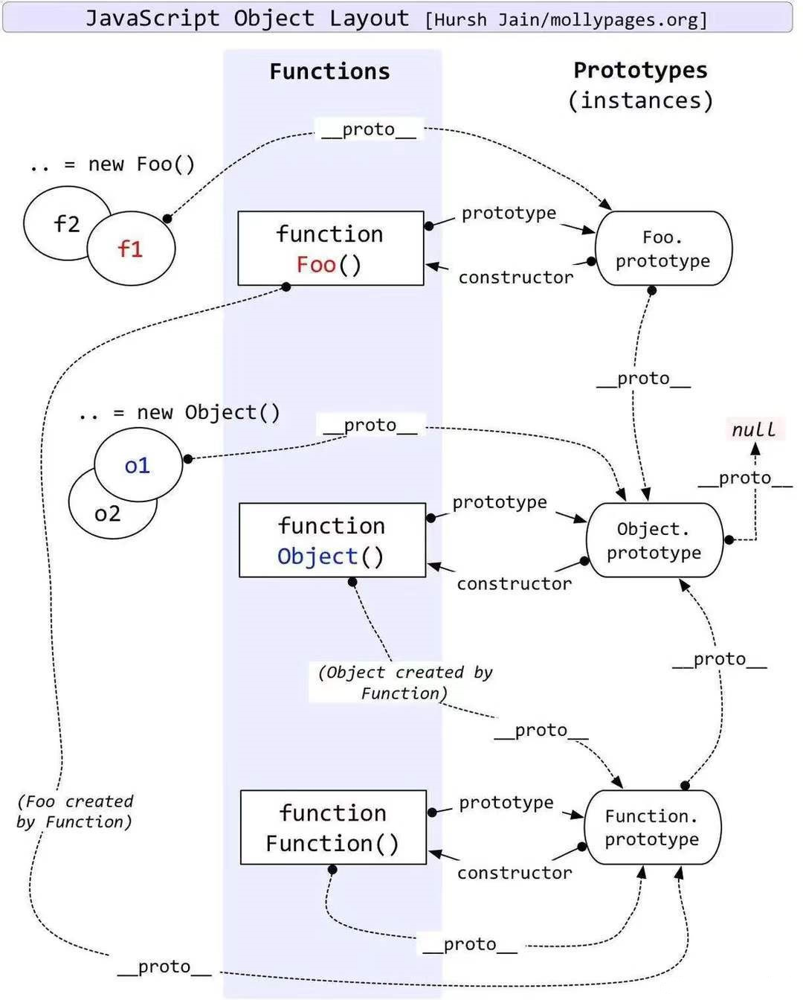

# 大厂前端面试题精选

## JavaScript 部分

### 1. JavaScript 有哪些数据类型，它们的区别？
JavaScript 共有八种数据类型，分别是 Number、String、Boolean、Undefined、Null、Object、Symbol、BigInt。

其中 Symbol 和 BigInt 是 ES6中新增的数据类型：
- Symbol 代表创建后独一无二且不可变的数据类型，它主要是为了解决可能出现的全局变量冲突的问题。
- BigInt 是一种数字类型的数据，它可以表示任意精度格式的整数，使用 BigInt 可以安全地存储和操作大整数，即使这个数已经超出了Number 能够表示的安全整数范围。

这些数据可以分为原始数据类型和引用数据类型：
- 栈：原始数据类型（Number、String、Boolean、Undefined、Null）
- 堆：引用数据类型（对象、数组和函数）

两种类型的区别在于存储位置的不同：
- 原始数据类型直接存储在栈（stack）中的简单数据段，占据空间小、大小固定，属于被频繁使用数据，所以放入栈中存储；
- 引用数据类型存储在堆（heap）中的对象，占据空间大、大小不固定。如果存储在栈中，将会影响程序运行的性能；引用数据类型在栈中存储了指针，该指针指向堆中该实体的起始地址。当解释器寻找引用值时，会首先检索其在栈中的地址，取得地址后从堆中获得实体。

堆和栈的概念存在于数据结构和操作系统内存中，
在数据结构中：
- 在数据结构中，栈中数据的存取方式为先进后出。
- 堆是一个优先队列，是按优先级来进行排序的，优先级可以按照大小来规定。

在操作系统中，内存被分为栈区和堆区：
- 栈区内存由编译器自动分配释放，存放函数的参数值、局部变量的值等。其操作方式类似于数据结构中的栈。
- 堆区内存一般由开发者分配释放，若开发者不释放，程序结束时可能由垃圾回收机制回收。

### 2. 数据类型检测的方式有哪些？
1. typeof
    ```
    typeof 2;                   // number
    typeof 'str';               // string
    typeof true;                // boolean
    typeof undefined;           // undefined
    typeof null;                // object
    typeof [];                  // object
    typeof function (){};       // function
    typeof {};                  // object
    ```
    其中数组、对象、null 都会被判断为 object，其他判断都正确。

2. instanceof
    instanceof 可以正确判断对象的类型，其内部运行机制是判断在其原型链中能否找到该类型的原型。
    ```
    2 instanceof Number;                        // false
    'str' instanceof String;                    // false
    true instanceof Boolean;                    // false

    [] instanceof Array;                        // true
    function (){} instanceof Function;          // true
    {} instanceof Object;                       // true
    ```
    可以看到，instanceof 只能正确判断引用数据类型，而不能判断基本数据类型。instanceof 运算符可以用来测试一个对象在其原型链中是否存在一个构造函数的 prototype 属性。

3. constructor
    ```
    (2).constructor === Number;                     // true
    ('str').constructor === String;                 // true
    (true).constructor === Boolean;                 // true
    ([]).constructor === Array;                     // true
    (function (){}).constructor === Function;       // true
    ({}).constructor === Object;                    // true
    ```
    constructor 有两个作用，一是判断数据的类型，二是对象实例通过constrcutor 对象访问它的构造函数。
    需要注意，如果创建一个对象来改变它的原型，constructor 就不能用来判断数据类型了：
    ```
    function Fn(){}
    Fn.prototype = new Array();
    var f = new Fn();
    console.log(f.constructor === Fn);          // false
    console.log(f.constructor === Array);       // true
    ```
    
4. Object.prototype.toString.call()
    Object.prototype.toString.call() 使用 Object 对象的原型方法toString 来判断数据类型：
    ```
    var a = Object.prototype.toString;
    console.log(a.call(2));                     // [object Number]
    console.log(a.call('str'));                 // [object String]
    console.log(a.call(true));                  // [object Boolean]
    console.log(a.call(undefined));             // [object Undefined]
    console.log(a.call(null));                  // [object Null]
    console.log(a.call([]));                    // [object Array]
    console.log(a.call(function (){}));         // [object Function]
    console.log(a.call({}));                    // [object Object]
    ```
    同样是检测对象 obj 调用 toString 方法，obj.toString()的结果和Object.prototype.toString.call(obj)的结果不一样，这是为什么？
    这是因为 toString 是 Object 的原型方法，而 Array、function 等类型作为 Object 的实例，都重写了 toString 方法。不同的对象类型调用 toString 方法时，根据原型链的知识，调用的是对应的重写之后的 toString 方法（function 类型返回内容为函数体的字符串，Array类型返回元素组成的字符串…），而不会去调用 Object 上原型toString 方法（返回对象的具体类型），所以采用 obj.toString()不能得到其对象类型，只能将 obj 转换为字符串类型；因此，在想要得到对象的具体类型时，应该调用 Object 原型上的 toString 方法。

### 3. null 和 undefined 区别
首先 Undefined 和 Null 都是基本数据类型，这两个基本数据类型分别都只有一个值，就是 undefined 和 null。

undefined 代表的含义是未定义，null 代表的含义是空对象。一般变量声明了但还没有定义的时候会返回 undefined，null 主要用于赋值给一些可能会返回对象的变量，作为初始化。

undefined 在 JavaScript 中不是一个保留字，这意味着可以使用 undefined 来作为一个变量名，但是这样的做法是非常危险的，它会影响对 undefined 值的判断。我们可以通过一些方法获得安全的undefined 值，比如说 void 0。
    
当对这两种类型使用 typeof 进行判断时，Null 类型化会返回“object”，这是一个历史遗留问题。当使用双等号对两种类型的值进行比较时会返回 true，使用三个等号时会返回 false。

### 4. 如何获取安全的 undefined 值？
因为 undefined 是一个标识符，所以可以被当作变量来使用和赋值， 但是这样会影响 undefined 的正常判断。表达式 void ___ 没有返回值，因此返回结果是 undefined。void 并不改变表达式的结果， 只是让表达式不返回值。因此可以用 void 0 来获得 undefined。

### 5. intanceof 操作符的实现原理及实现
instanceof 运算符用于判断构造函数的 prototype 属性是否出现在对象的原型链中的任何位置。
```
function myInstanceof(left, right) {
    // 获取对象的原型
    let proto = Object.getPrototypeOf(left);
    // 获取构造函数的 prototype 对象
    let prototype = right.prototype;

    // 判断构造函数的 prototype 对象是否在对象的原型链上
    while (true) {
        if (!proto) return false;
        if (proto === prototype) return true;
        // 如果没有找到，就继续从其原型上找，Object.getPrototypeOf 方法用来获取指定对象的原型
        proto = Object.getPrototypeOf(proto);
    }
}
```

### 6. Object.is() 与比较操作符 “\=\=\=”、“\=\=” 的区别？
使用双等号（==）进行相等判断时，如果两边的类型不一致，则会进行强制类型转化后再进行比较。

使用三等号（===）进行相等判断时，如果两边的类型不一致时，不会做强制类型准换，直接返回 false。

使用 Object.is 来进行相等判断时，一般情况下和三等号的判断相同，它处理了一些特殊的情况，比如 -0 和 +0 不再相等，两个 NaN 是相等的。

### 7. 什么是 JavaScript 中的包装类型？
在 JavaScript 中，基本类型是没有属性和方法的，但是为了便于操作基本类型的值，在调用基本类型的属性或方法时 JavaScript 会在后台隐式地将基本类型的值转换为对象，如：
```
const a = 'abc';
a.length;           // 3
a.toUpperCase();    // 'ABC'
```
在 访 问 'abc'.length 时 ， JavaScript 将 'abc' 在后台转换成String('abc')，然后再访问其 length 属性。

JavaScript 也可以使用 Object 函数显式地将基本类型转换为包装类型：
```
var a = 'abc';
Object(a);  // String {"abc"}
```
也可以使用 valueOf 方法将包装类型倒转成基本类型：
```
var a = 'abc';
var b = Object(a);
var c = b.valueOf();    // 'abc'
```
看看如下代码会打印出什么：
```
var a = new Boolean(false);
if (!a) {
    console.log("Oops");    // never runs
}
```
答案是什么都不会打印，因为虽然包裹的基本类型是 false，但是 false 被包裹成包装类型后就成了对象，所以其非值为 false，所以循环体中的内容不会运行。

### 8. const 对象的属性可以修改吗?
const 保证的并不是变量的值不能改动，而是变量指向的那个内存地址不能改动。对于基本类型的数据（数值、字符串、布尔值），其值就保存在变量指向的那个内存地址，因此等同于常量。 

但对于引用类型的数据（主要是对象和数组）来说，变量指向数据的内存地址，保存的只是一个指针，const 只能保证这个指针是固定不变的，至于它指向的数据结构是不是可变的，就完全不能控制了。

### 9. 如何判断一个对象是空对象
使用 JSON 自带的 .stringify 方法来判断：
```
if (JSON.stringify(Obj) == '{}') {
    console.log('空对象');
}
```
使用 ES6 新增的方法 Object.keys()来判断：
```
if (Object.keys(Obj).length <= 0) {
    console.log('空对象');
}
```

### 10. 为什么会有 BigInt 的提案？
JavaScript 中 Number.MAX_SAFE_INTEGER 表示最⼤安全数字，计算结果是 9007199254740991，即在这个数范围内不会出现精度丢失（⼩数除外）。但是⼀旦超过这个范围，js 就会出现计算不准确的情况，这在⼤数计算的时候不得不依靠⼀些第三⽅库进⾏解决，因此官⽅提出了 BigInt 来解决此问题。

### 11. 扩展运算符的作用及使用场景
1. 对象扩展运算符
对象的扩展运算符(...)用于取出参数对象中的所有可遍历属性，拷贝到当前对象之中。
```
let bar = {a: 1, b: 2};
let baz = {...bar}; // {a: 1, b: 2}
```
上述方法实际上等价于：
```
let bar = {a: 1, b: 2};
let baz = Object.assign({}, bar); // {a: 1, b: 2}
```
Object.assign 方法用于对象的合并，将源对象（source）的所有可枚举属性，复制到目标对象（target）。Object.assign 方法的第一个参数是目标对象，后面的参数都是源对象。(如果目标对象与源对象有同名属性，或多个源对象有同名属性，则后面的属性会覆盖前面的属性)。
同样，如果用户自定义的属性，放在扩展运算符后面，则扩展运算符内部的同名属性会被覆盖掉.
```
let bar = {a: 1, b: 2};
let baz = {...bar, ...{a: 2, c: 2}}; // {a: 2, b: 2, c: 2}
```
利用上述特性就可以很方便的修改对象的部分属性。在 redux 中的 reducer 函数规定必须是一个纯函数，reducer 中的 state 对象要求不能直接修改，可以通过扩展运算符把修改路径的对象都复制一遍，然后产生一个新的对象返回。
需要注意：扩展运算符对对象实例的拷贝属于浅拷贝。
2. 数组扩展运算符
数组的扩展运算符可以将一个数组转为用逗号分隔的参数序列，且每次只能展开一层数组。
```
console.log(...[1, 2, 3]); // 1 2 3
console.log(...[1, [2, 3, 4], 5]); // 1 [2, 3, 4] 5
```
下面是数组的扩展运算符的应用：
将数组转换为参数序列
```
function add(x, y) {
    return x + y;
}
const numbers = [1, 2];
add(...numbers); // 3
```
复制数组
```
const arr1 = [1, 2];
const arr2 = [...arr1];
```
要记住：扩展运算符(…)用于取出参数对象中的所有可遍历属性，拷贝到当前对象之中，这里参数对象是个数组，数组里面的所有对象都是基础数据类型，将所有基础数据类型重新拷贝到新的数组中。
合并数组
如果想在数组内合并数组，可以这样
```
const arr1 = ["two", "three"];
const arr2 = ["one", ...arr1, "four", "five"]; // ["one", "two", "three", "four", "five"]
```
扩展运算符与解构赋值结合起来，用于生成数组
```
const [first, ...rest] = [1, 2, 3, 4, 5];
first // 1
rest // [2, 3, 4, 5]
```
需要注意：如果将扩展运算符用于数组赋值，只能放在参数的最后一位，否则会报错。
```
const [...rest, last] = [1, 2, 3, 4, 5]; // Uncaught SyntaxError: Rest element must be last element
const [first, ...rest, last] = [1, 2, 3, 4, 5]; // Uncaught SyntaxError: Rest element must be last element
```
将字符串转为真正的数组
```
[..."hello"] //  ["h", "e", "l", "l", "o"]
```
任何 Iterator 接口的对象，都可以用扩展运算符转为真正的数组
比较常见的应用是可以将某些数据结构转为数组：
```
// arguments对象
function foo() {
    const args = [...arguments];
}
```
用于替换 es5 中的 Array.prototype.slice.call(arguments)写法。
使用 Math 函数获取数组中特定的值
```
const numbers = [9, 2, 7, 1];
Math.min(...numbers); // 1
Math.max(...numbers); // 9
```
### 12. 对作用域、作用域链的理解
1. 全局作用域和函数作用域
（1）全局作用域
- 最外层函数和最外层函数外面定义的变量拥有全局作用域
- 所有未定义直接赋值的变量自动声明为全局作用域
- 所有 window 对象的属性拥有全局作用域
全局作用域有很大的弊端，过多的全局作用域变量会污染全局命名空间，容易引起命名冲突。
（2）函数作用域
声明在函数内部的变量，一般只有固定的代码片段可以访问到
作用域是分层的，内层作用域可以访问外层作用域，反之不行
2. 块级作用域
使用 ES6 中新增的 let 和 const 指令可以声明块级作用域，块级作用域可以在函数中创建也可以在一个代码块中的创建（由{ }包裹的代码片段）
let 和 const 声明的变量不会有变量提升，也不可以重复声明
在循环中比较适合绑定块级作用域，这样就可以把声明的计数器变量限制在循环内部。

**作用域链：**
在当前作用域中查找所需变量，但是该作用域没有这个变量，那这个变量就是自由变量。如果在自己作用域找不到该变量就去父级作用域查找，依次向上级作用域查找，直到访问到 window 对象后被终止，这一层层的关系就是作用域链。
作用域链的作用是保证对执行环境有权访问的所有变量和函数的有序访问，通过作用域链，可以访问到外层环境的变量和函数。
作用域链的本质上是一个指向变量对象的指针列表。变量对象是一个包含了执行环境中所有变量和函数的对象。作用域链的前端始终都是当前执行上下文的变量对象。全局执行上下文的变量对象（也就是全局对象）始终是作用域链的最后一个对象。
当查找一个变量时，如果当前执行环境中没有找到，可以沿着作用域链向后查找。

### 13. 对原型、原型链的理解
在 JavaScript 中是使用构造函数来新建一个对象的，每一个构造函数的内部都有一个 prototype 属性，它的属性值是一个对象，这个对象包含了可以由该构造函数的所有实例共享的属性和方法。当使用构造函数新建一个对象后，在这个对象的内部将包含一个指针，这个指针指向构造函数的 prototype 属性对应的值，在 ES5 中这个指针被称为对象的原型。一般来说不应该能够获取到这个值的，但是现在浏览器中都实现了__proto__ 属性来访问这个属性，但是最好不要使用这个属性，因为它不是规范中规定的。ES5 中新增了一个 Object.getPrototypeOf() 方法，可以通过这个方法来获取对象的原型。
当访问一个对象的属性时，如果这个对象内部不存在这个属性，那么它就会去它的原型对象里找这个属性，这个原型对象又会有自己的原型，于是就这样一直找下去，也就是原型链的概念。原型链的尽头一般来说都是 Object.prototype 所以这就是新建的对象为什么能够使用 toString() 等方法的原因。
特点：JavaScript 对象是通过引用来传递的，创建的每个新对象实体中并没有一份属于自己的原型副本。当修改原型时，与之相关的对象也会继承这一改变。


### 14. 原型链的终点是什么？如何打印出原型链的终点？
由于 Object 是构造函数，原型链终点 Object.prototype.\_\_proto__，而 Object.prototype.\_\_proto__=== null // true，所以，原型链的终点是 null。原型链上的所有原型都是对象，所有的对象最终都是由 Object 构造的，而 Object.prototype 的下一级是 Object.prototype.\_\_proto__。

### 15. 对象创建的方式有哪些？
一般使用字面量的形式直接创建对象，但是这种创建方式对于创建大量相似对象的时候，会产生大量的重复代码。但 js 和一般的面向对象的语言不同，在 ES6 之前它没有类的概念。但是可以使用函数来进行模拟，从而产生出可复用的对象创建方式，常见的有以下几种：

1. 第一种是**工厂模式**，工厂模式的主要工作原理是用函数来封装创建对象的细节，从而通过调用函数来达到复用的目的。但是它有一个很大的问题就是创建出来的对象无法和某个类型联系起来，它只是简单的封装了复用代码，而没有建立起对象和类型间的关系。
2. 第二种是**构造函数模式**。js 中每一个函数都可以作为构造函数，只要一个函数是通过 new 来调用的，那么就可以把它称为构造函数。执行构造函数首先会创建一个对象，然后将对象的原型指向构造函数的 prototype 属性，然后将执行上下文中的 this 指向这个对象，最后再执行整个函数。如果返回值不是对象，则返回新建的对象。因为 this 的值指向了新建的对象，因此可以使用 this 给对象赋值。
构造函数模式相对于工厂模式的优点是，所创建的对象和构造函数建立起了联系，因此可以通过原型来识别对象的类型。但是构造函数存在的一个缺点就是，造成了不必要的函数对象的创建，因为在 js 中函数也是一个对象，因此如果对象属性中如果包含函数的话，那么每次都会新建一个函数对象，浪费了不必要的内存空间，因为函数是所有的实例都可以通用的。
3. 第三种模式是**原型模式**，因为每一个函数都有一个 prototype属性，这个属性是一个对象，它包含了通过构造函数创建的所有实例都能共享的属性和方法。因此可以使用原型对象来添加公用属性和方法，从而实现代码的复用。这种方式相对于构造函数模式来说，解决了函数对象的复用问题。但这种模式也存在一些问题，一个是没有办法通过传入参数来初始化值；另一个是如果存在一个引用类型如 Array 这样的值，那么所有的实例将共享一个对象，一个实例对引用类型值的改变会影响所有的实例。
4. 第四种模式是**组合使用构造函数模式和原型模式**，这是创建自定义类型的最常见方式。因为构造函数模式和原型模式分开使用都存在一些问题，因此可以组合使用这两种模式，通过构造函数来初始化对象的属性，通过原型对象来实现函数方法的复用。这种方法很好的解决了两种模式单独使用时的缺点，但是有一点不足的就是，因为使用了两种不同的模式，所以对于代码的封装性不够好。
5. 第五种模式是**动态原型模式**，这一种模式将原型方法赋值的创建过程移动到了构造函数的内部，通过对属性是否存在的判断，可以实现仅在第一次调用函数时对原型对象赋值一次的效果。这一种方式很好地对上面的混合模式进行了封装。
6. 第六种模式是**寄生构造函数模式**，这一种模式和工厂模式的实现基本相同，我对这个模式的理解是，它主要是基于一个已有的类型，在实例化时对实例化的对象进行扩展。这样既不用修改原来的构造函数，也达到了扩展对象的目的。它的一个缺点和工厂模式一样，无法实现对象的识别。

### 16. 对象继承的方式有哪些？
1. 第一种是以**原型链**的方式来实现继承，但是这种实现方式存在的缺点是，在包含有引用类型的数据时，会被所有的实例对象所共享，容易造成修改的混乱。还有就是在创建子类型的时候不能向超类型传递参数。
2. 第二种方式是使用**借用构造函数**的方式，这种方式是通过在子类型的函数中调用超类型的构造函数来实现的，这一种方法解决了不能向超类型传递参数的缺点，但是它存在的一个问题就是无法实现函数方法的复用，并且超类型原型定义的方法子类型也没有办法访问到。
3. 第三种方式是**组合继承**，组合继承是将原型链和借用构造函数组合起来使用的一种方式。通过借用构造函数的方式来实现类型的属性的继承，通过将子类型的原型设置为超类型的实例来实现方法的继承。这种方式解决了上面的两种模式单独使用时的问题，但是由于我们是以超类型的实例来作为子类型的原型，所以调用了两次超类的构造函数，造成了子类型的原型中多了很多不必要的属性。
4. 第四种方式是**原型式继承**，原型式继承的主要思路就是基于已有的对象来创建新的对象，实现的原理是，向函数中传入一个对象，然后返回一个以这个对象为原型的对象。这种继承的思路主要不是为了实现创造一种新的类型，只是对某个对象实现一种简单继承，ES5 中定义的 Object.create() 方法就是原型式继承的实现。缺点与原型链方式相同。
5. 第五种方式是**寄生式继承**，寄生式继承的思路是创建一个用于封装继承过程的函数，通过传入一个对象，然后复制一个对象的副本，然后对象进行扩展，最后返回这个对象。这个扩展的过程就可以理解是一种继承。这种继承的优点就是，如果这个对象不是自定义类型和构造函数时，对一个简单对象实现继承。缺点是没有办法实现函数的复用。
6. 第六种方式是**寄生式组合继承**，组合继承的缺点就是使用超类型的实例做为子类型的原型，导致添加了不必要的原型属性。寄生式组合继承的方式是使用超类型的原型的副本来作为子类型的原型，这样就避免了创建不必要的属性。

### 17. 对 this 对象的理解
this 是执行上下文中的一个属性，它指向最后一次调用这个方法的对象。在实际开发中，this 的指向可以通过四种调用模式来判断：

第一种是函数调用模式，当一个函数不是一个对象的属性时，直接作为函数来调用时，this 指向全局对象。

第二种是方法调用模式，如果一个函数作为一个对象的方法来调用时，this 指向这个对象。

第三种是构造器调用模式，如果一个函数用 new 调用时，函数执行前会新创建一个对象，this 指向这个新创建的对象。

第四种是 apply 、 call 和 bind 调用模式，这三个方法都可以显式的指定调用函数的 this 指向。其中 apply 方法接收两个参数：一个是 this 绑定的对象，一个是参数数组。call 方法接收的参数，第一个是 this 绑定的对象，后面的其余参数是传入函数执行的参数。
也就是说，在使用 call() 方法时，传递给函数的参数必须逐个列举出来。bind 方法通过传入一个对象，返回一个 this 绑定了传入对象的新函数。这个函数的 this 指向除了使用 new 时会被改变，其他情况下都不会改变。

这四种方式，使用构造器调用模式的优先级最高，然后是 apply、call 和 bind 调用模式，然后是方法调用模式，然后是函数调用模式。

### 18. call() 和 apply() 的区别？
它们的作用一模一样，区别仅在于传入参数的形式的不同。

apply 接受两个参数，第一个参数指定了函数体内 this 对象的指向，第二个参数为一个带下标的集合，这个集合可以为数组，也可以为类数组，apply 方法把这个集合中的元素作为参数传递给被调用的函数。

call 传入的参数数量不固定，跟 apply 相同的是，第一个参数也是代表函数体内的 this 指向，从第二个参数开始往后，每个参数被依次传入函数。

### 19. 箭头函数的 this 指向哪⾥？
箭头函数不同于传统 JavaScript 中的函数，箭头函数并没有属于自己的 this，它所谓的 this 是捕获其所在上下⽂的 this 值，作为自己的 this 值，并且由于没有属于自己的 this，所以是不会被 new 调⽤的，这个所谓的 this 也不会被改变。

可以⽤Babel 理解⼀下箭头函数:
```
const obj = {
    getArrow() {
        return () => {
            console.log(this === obj);
        };
    }
}
```
转化后：
```
var obj = {
    getArrow: function getArrow() {
        var _this = this;
        return function () {
            console.log(_this === obj);
        };
    }
}
```

### 20. 如果 new 一个箭头函数的会怎么样？
箭头函数是 ES6 中的提出来的，它没有 prototype ，也没有自己的 this 指向，更不可以使用 arguments 参数，所以不能 New 一个箭头函数。

new 操作符的实现步骤如下：
1. 创建一个对象
2. 将构造函数的作用域赋给新对象（也就是将对象的__proto__属性指向构造函数的 prototype 属性）
3. 指向构造函数中的代码，构造函数中的 this 指向该对象（也就是为这个对象添加属性和方法）
4. 返回新的对象
所以，上面的第二、三步，箭头函数都是没有办法执行的。

### 21. for、for…in、for…of、forEach、map 等的区别
1. **for循环：**
根据下标遍历
常规语句遍历，可循环数字、字符串、数组。
有下标，通过下标取值，可通过return、break退出循环，或者通过continue语句跳出本次循环。
> (1)三个表达式都可以省略，但是表达式之间的分号不能省略。都省略的话就创建了一个无穷循环。
> (2)初始化变量：给循环变量、其他变量进行初始化。
> (3)条件表达式：控制循环体语句是否执行。如果只包含条件表达式for循环就变成while循环。
> (4)操作表达式：使循环趋向结束的语句。
2. **for…in语句**
根据key遍历
for…in类似于增强for循环，我们可以简单理解为它适合遍历对象。
应用场景:遍历数组以及遍历对象的属性。
for…in以原始插入顺序访问对象的可枚举属性，包括从原型继承而来的可枚举属性。遍历对象时会从原型上继承属性，可以用 hasOwnProperty 识别出继承属性。
for…in用于遍历数组时，可以将数组看作对象，数组下标看作属性名，也就输出结果是数组的下标。但用for…in遍历数组时不一定会按照数组的索引顺序。
数组遍历下标，对象遍历属性。
3. **for…of语句**
根据值遍历
for…of语句是一种严格的迭代语句，用于遍历可迭代对象的元素。
for…of语句在可迭代对象（Array，Map，Set，String，TypedArray，arguments 对象等等）上创建一个迭代循环，为每个不同属性的值执行语句。
使用for…in循环时，获得的是数组的下标；使用for…of循环时，获得的是数组的元素值。
for…of遍历Map时，可以获得整个键值对对象，也可以只获得键值，或者分别获得键与值。
用for…of来遍历数据，避免了所有for…in的弊端，与forEach相比可以正确响应break，continue，return语句。
4. **forEach语句**
foreach 语句是对数组的每个元素根据提供的函数执行一次。是for语句的特殊简化版本，不能完全取代for语句，但任何foreach语句都可以改写为for语句版本。
遍历全部数据，不能通过return结束循环，消耗性能。
用于不转换数据的全部遍历。
forEach一般只能适用于数组，功能是从头到尾把数组遍历一遍，可以有三个参数，后两个可以不写。
```
// 手写forEach
Array.prototype.myForEach = function (fn) {
    for (let i = 0; i < this.length; i++) {
        fn(this[i], i, this);
    }
}
```
5. **map**
根据index遍历
和forEach相比，使用方法一样，有三个参数，map只能对元素进行加工处理，产生一个新的数组对象。
遍历全部数据，不能通过return结束，消耗性能，不要常用。
常用于转换数据结构，比forEach快。
6. **filter**
对原数组进行过滤筛选，生成新的数组，使用和map一样有三个参数。如果对空数组进行筛选，会返回undefined。filter不会改变原数组。
遍历全部数据，返回数组，过滤成新的数组。
常用于：过滤不符合项，数组去重，过滤空字符串、undefined、null等。

**比较**
优缺点
for:
优点：程序简洁，结构清晰，循环初始化，循环变量化和循环条件位置突出。
缺点：结构比while循环复杂，容易出编码错误。

for…in:
优点：类似于增强for循环，适合遍历对象。
缺点：对象遍历属性，包括从原型继承而来的可枚举属性，性能较差，如不需要，则要额外处理。数组遍历下标，但不一定会按照数组的索引顺序。

for…of:
优点：避免了for…in的所有缺点，支持break,continue,return。支持遍历Array（数组）, String（字符串）, Map（映射）, Set（集合）,TypedArray（类型化数组）、arguments、NodeList对象、Generator等可迭代的数据结构。
缺点：不适用于遍历普通对象。

forEach:
优点：遍历的时候更加简洁，效率和for循环相同，不用关心集合下标的问题，减少了出错的效率。
缺点：不能同时遍历多个集合，在遍历的时候无法修改和删除集合数据，不能使用break，continue语句跳出循环，或者使用return从函数体返回，对于空数组不会执行回调函数。

**区别**
四个算法语句区别主要体现在响应break, continue, return上和使用的对象上。

for 语句性能最好；能响应break, continue, return控制循环。

forEach 无法响应break, continue, return控制循环。

for…in 无法响应break, continue, return控制循环；for in 主要针对对象，它不仅会循环对象本身的属性，还会查找循环原型上的属性；循环的顺序不确定。

for…of 能响应break, continue, return控制循环，还能遍历map、set 等类数组，但是不能循环普通的对象

for…of 是 ES6 新增的遍历方式，允许遍历一个含有 iterator 接口的数据结构（数组、对象等）并且返回各项的值，和 ES3 中的 for…in 的区别如下
for…of 遍历获取的是对象的键值，for…in 获取的是对象的键名；
for…in 会遍历对象的整个原型链，性能非常差不推荐使用，而for…of 只遍历当前对象不会遍历原型链；
对于数组的遍历，for…in 会返回数组中所有可枚举的属性(包括原型链上可枚举的属性)，for…of 只返回数组的下标对应的属性值；
总结：for…in 循环主要是为了遍历对象而生，不适用于遍历数组；for…of 循环可以用来遍历数组、类数组对象，字符串、Set、Map 以及 Generator 对象。