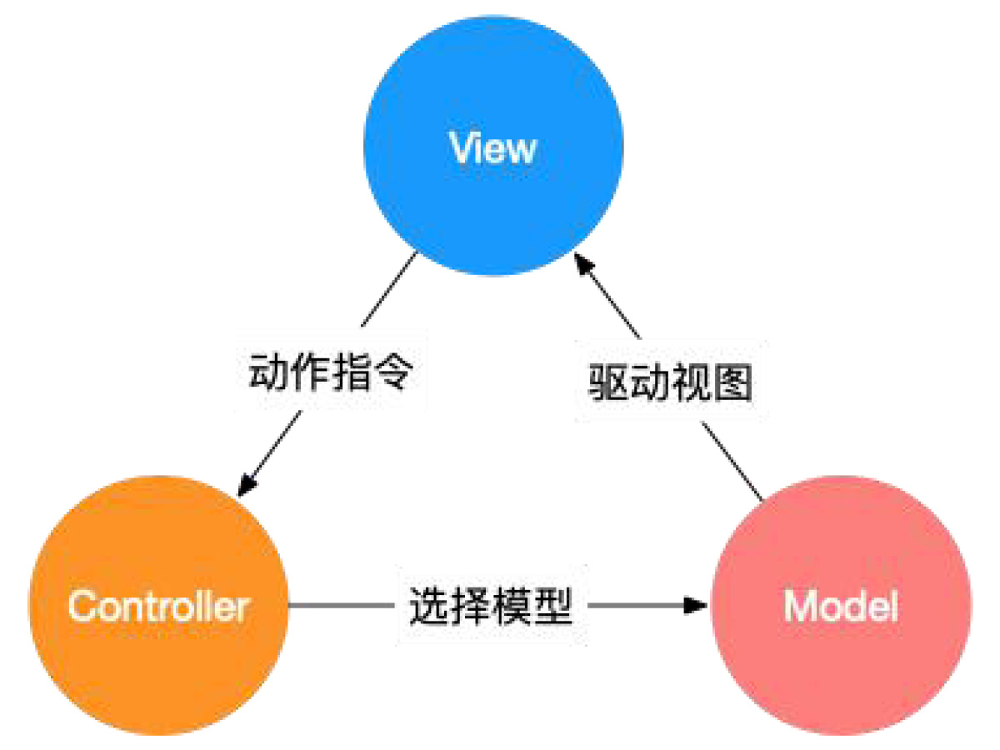
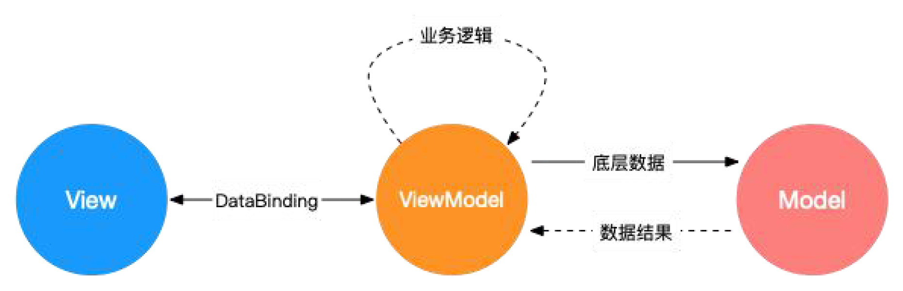

# 大厂前端面试题精选

## Vue 部分

### 1. Vue 的基本原理
当一个 Vue 实例创建时， Vue 会遍历 data 中的属性 ， 用 Object.defineProperty （ vue3.0 使用 proxy ） 将它们转为 getter / setter，并且在内部追踪相关依赖，在属性被访问和修改时通知变化。 每个组件实例都有相应的 watcher 程序实例，它会在组件渲染的过程中把属性记录为依赖，之后当依赖项的 setter 被调用时，会通知 watcher 重新计算，从而致使它关联的组件得以更新。


### 2. 双向数据绑定的原理
Vue.js 是采用数据劫持结合发布者-订阅者模式的方式，通过 Object.defineProperty() 来劫持各个属性的 setter / getter，在数据变动时发布消息给订阅者，触发相应的监听回调。主要分为以下几个步骤：
1. 需要 observe 的数据对象进行递归遍历，包括子属性对象的属性，都加上 setter 和 getter。这样的话，给这个对象的某个值赋值，就会触发 setter，那么就能监听到了数据变化。
2. compile 解析模板指令，将模板中的变量替换成数据，然后初始化渲染页面视图，并将每个指令对应的节点绑定更新函数，添加监听数据的订阅者，一旦数据有变动，收到通知，更新视图。
3. Watcher 订阅者是 Observer 和 Compile 之间通信的桥梁，主要做的事情是: ①在自身实例化时往属性订阅器(dep)里面添加自己 ②自身必须有一个 update() 方法 ③待属性变动 dep.notice() 通知时，能调用自身的 update() 方法，并触发 Compile 中绑定的回调，则功成身退。
4. MVVM 作为数据绑定的入口，整合 Observer、Compile 和 Watcher 三者，通过 Observer 来监听自己的 model 数据变化，通过 Compile 来解析编译模板指令，最终利用 Watcher 搭起 Observer 和 Compile 之间的通信桥梁，达到数据变化 -> 视图更新；视图交互变化(input) -> 数据 model 变更的双向绑定效果。


### 3. MVVM、MVC、MVP 的区别
MVC、MVP 和 MVVM 是三种常见的软件架构设计模式，主要通过分离关注点的方式来组织代码结构，优化开发效率。
在开发单页面应用时，往往一个路由页面对应了一个脚本文件，所有的页面逻辑都在一个脚本文件里。页面的渲染、数据的获取，对用户事件的响应所有的应用逻辑都混合在一起，这样在开发简单项目时，可能看不出什么问题，如果项目变得复杂，那么整个文件就会变得冗长、混乱，这样对项目开发和后期的项目维护是非常不利的。
**1. MVC**
MVC 通过分离 Model、View 和 Controller 的方式来组织代码结构。
其中 View 负责页面的显示逻辑，Model 负责存储页面的业务数据，以及对相应数据的操作。并且 View 和 Model 应用了观察者模式，当 Model 层发生改变的时候它会通知有关 View 层更新页面。
Controller 层是 View 层和 Model 层的纽带，它主要负责用户与应用的响应操作，当用户与页面产生交互的时候，Controller 中的事件触发器就开始工作了，通过调用 Model 层，来完成对 Model 的修改，然后 Model 层再去通知 View 层更新。

**2. MVVM**
MVVM 分为 Model、View、ViewModel：
Model 代表数据模型，数据和业务逻辑都在 Model 层中定义；
View 代表 UI 视图，负责数据的展示；
ViewModel 负责监听 Model 中数据的改变并且控制视图的更新，处理用户交互操作；
Model 和 View 并无直接关联，而是通过 ViewModel 来进行联系的，Model 和 ViewModel 之间有着双向数据绑定的联系。因此当 Model 中的数据改变时会触发 View 层的刷新，View 中由于用户交互操作而改变的数据也会在 Model 中同步。
这种模式实现了 Model 和 View 的数据自动同步，因此开发者只需要专注于数据的维护操作即可，而不需要自己操作 DOM。

**3. MVP**
MVP 模式与 MVC 唯一不同的在于 Presenter 和 Controller。在 MVC 模式中使用观察者模式，来实现当 Model 层数据发生变化的时候，通知 View 层的更新。这样 View 层和 Model 层耦合在一起，当项目逻辑变得复杂的时候，可能会造成代码的混乱，并且可能会对代码的复用性造成一些问题。MVP 的模式通过使用 Presenter 来实现对 View 层和 Model 层的解耦。MVC 中的 Controller 只知道 Model 的接口，因此它没有办法控制 View 层的更新，MVP 模式中，View 层的接口暴露给了 Presenter，因此可以在 Presenter 中将 Model 的变化和 View 的变化绑定在一起，以此来实现 View 和 Model 的同步更新。这样就实现了对 View 和 Model 的解耦，Presenter 还包含了其他的响应逻辑。

### 4. slot 是什么？有什么作用？原理是什么？
slot 又名插槽，是 Vue 的内容分发机制，组件内部的模板引擎使用 slot 元素作为承载分发内容的出口。插槽 slot 是子组件的一个模板标签元素，而这一个标签元素是否显示，以及怎么显示是由父组件决定的。slot 又分三类，默认插槽，具名插槽和作用域插槽。
默认插槽：又名匿名插槽，当 slot 没有指定 name 属性值的时候，默认显示插槽，一个组件内只有有一个匿名插槽。
具名插槽：带有具体名字的插槽，也就是带有 name 属性的 slot，一个组件可以出现多个具名插槽。
作用域插槽：默认插槽、具名插槽的一个变体，可以是匿名插槽，也可以是具名插槽，该插槽的不同点是在子组件渲染作用域插槽时，可以将子组件内部的数据传递给父组件，让父组件根据子组件的传递过来的数据决定如何渲染该插槽。
实现原理：当子组件 vm 实例化时，获取到父组件传入的 slot 标签的内容，存放在 vm.\$slot 中，默认插槽为 vm.\$slot.default，具名插槽为 vm.\$slot.xxx，xxx 为插槽名，当组件执行渲染函数时候，遇到 slot 标签，使用 $slot 中的内容进行替换，此时可以为插槽传递数据，若存在数据，则可称该插槽为作用域插槽。

### 5. $nextTick 原理及作用
Vue 的 nextTick 其本质是对 JavaScript 执行原理 EventLoop 的一种应用。
nextTick 的核心是利用了如 Promise 、MutationObserver 、setImmediate 、setTimeout 的原生 JavaScript 方法来模拟对应的微/宏任务的实现，本质是为了利用 JavaScript 的这些异步回调任务队列来实现 Vue 框架中自己的异步回调队列。
nextTick 不仅是 Vue 内部的异步队列的调用方法，同时也允许开发者在实际项目中使用这个方法来满足实际应用中对 DOM 更新数据时机的后续逻辑处理。
nextTick 是典型的将底层 JavaScript 执行原理应用到具体案例中的示例，引入异步更新队列机制的原因：
如果是同步更新，则多次对一个或多个属性赋值，会频繁触发 UI/DOM 的渲染，可以减少一些无用渲染。
同时由于 VirtualDOM 的引入，每一次状态发生变化后，状态变化的信号会发送给组件，组件内部使用 VirtualDOM 进行计算得出需要更新的具体的 DOM 节点，然后对 DOM 进行更新操作，每次更新状态后的渲染过程需要更多的计算，而这种无用功也将浪费更多的性能，所以异步渲染变得更加至关重要。
Vue 采用了数据驱动视图的思想，但是在一些情况下，仍然需要操作 DOM。有时候，可能遇到这样的情况，DOM1 的数据发生了变化，而 DOM2 需要从 DOM1 中获取数据，那这时就会发现 DOM2 的视图并没有更新，这时就需要用到了 nextTick 了。
由于 Vue 的 DOM 操作是异步的，所以，在上面的情况中，就要将 DOM2 获取数据的操作写在 $nextTick 中。
```js
this.nextTick(() => {
    // 获取数据的操作...
})
```
所以，在以下情况下，会用到 nextTick：
在数据变化后执行的某个操作，而这个操作需要使用随数据变化而变化的 DOM 结构的时候，这个操作就需要方法在 nextTick() 的回调函数中。
在 vue 生命周期中，如果在 created() 钩子进行 DOM 操作，也一定要放在 nextTick() 的回调函数中。
因为在 created() 钩子函数中，页面的 DOM 还未渲染，这时候也没办法操作 DOM，所以，此时如果想要操作 DOM，必须将操作的代码放在 nextTick() 的回调函数中。

### 6. Vue 单页应用与多页应用的区别
概念：
SPA 单页面应用（SinglePage Web Application），指只有一个主页面的应用，一开始只需要加载一次 js、css 等相关资源。所有内容都包含在主页面，对每一个功能模块组件化。单页应用跳转，就是切换相关组件，仅仅刷新局部资源。
MPA 多页面应用 （MultiPage Application），指有多个独立页面的应用，每个页面必须重复加载 js、css 等相关资源。多页应用跳转，需要整页资源刷新。
区别：
| 对比项 \ 模式 | SPA | MPA |
|---|---|---|
| 结构 | 一个主页面 + 许多模块的组件 | 许多完整的页面 |
| 体验 | 页面切换快，体验佳；当初次加载文件过多时，需要做相关的调优 | 页面切换慢，网速慢的时候，体验尤其不好 |
| 资源文件 | 组件公用的资源只需要加载一次 | 每个页面都要自己加载公用的资源 |
| 适用场景 | 对体验度和流畅度有较高要求的应用，不利于 SEO（可借助 SSR 优化 SEO） | 适用于对 SEO 要求较高的应用 |
| 过渡动画 | Vue 提供了 transition 的封装组件，容易实现 | 很难实现 |
| 内容更新 | 相关组件的切换，即局部更新 | 整体 HTML 的切换，重复 HTTP 请求 |
| 路由模式 | 可以使用 hash，也可以使用 history | 普通链接跳转 |
| 数据传递 | 因为单页面，使用全局变量就好（Vue） | cookie、localStorage 等缓存方案，URL 参数，调用接口保存等 |
| 相关成本 | 前期开发成本较高，后期维护较为容易 | 前期开发成本低，后期维护比较麻烦，因为可能一个功能需要改很多地方 |

